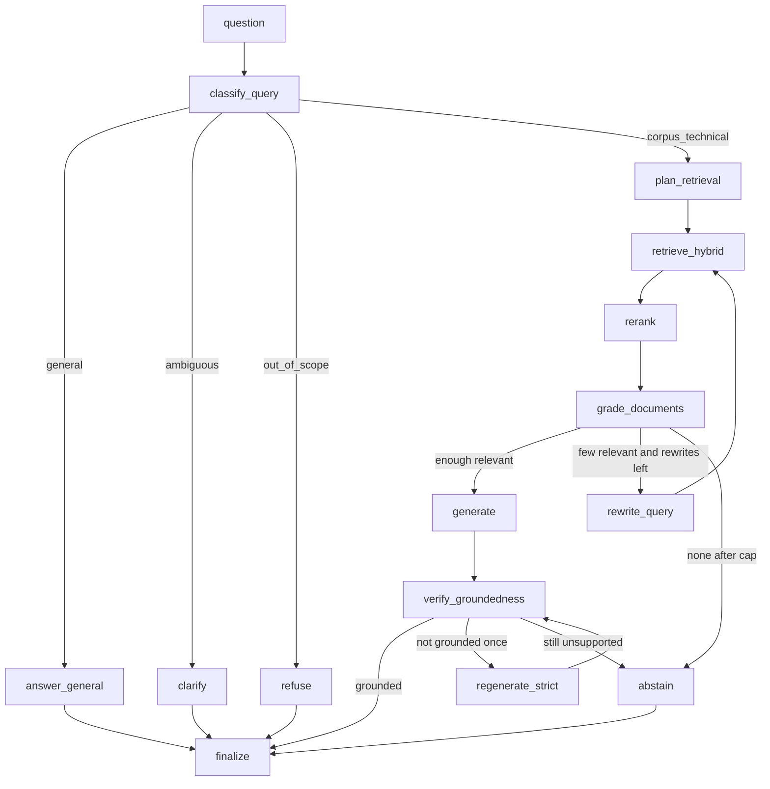

# Document Intelligence

Agentic hybrid RAG over commercial contracts (CUAD v1).

The system answers natural-language questions over the corpus, cites page-level evidence, abstains when the knowledge base does not support an answer, and answers ordinary world-knowledge questions from the LLM with a disclaimer. Every ingestion, retrieval, and generation stage is selected by YAML profile.

Package name and CLI: `docintel`. Python **3.12** (not 3.13). Pins live in [`pyproject.toml`](pyproject.toml) and [`uv.lock`](uv.lock).

```text
PDF corpus  ->  load / chunk / embed  ->  Qdrant (dense + BM25)
                                          |
question -> LangGraph (route, retrieve, grade, rewrite, verify, abstain)
                                          |
                         cited answer | abstain | general | refuse
```

Design: [`docs/IMPLEMENTATION_PLAN.md`](docs/IMPLEMENTATION_PLAN.md). Data rules: [`docs/DATA.md`](docs/DATA.md).

---

## Problem and approach

**Problem.** A legal / ops team sits on hundreds of commercial contracts and needs clause-level answers (governing law, termination, exclusivity, fee waivers) with a page cite. A fluent paragraph without evidence is a liability. The system must also refuse when the corpus does not support the claim.

**Domain.** Enterprise document intelligence: SEC-filed commercial agreements, 41 clause types.

**Approach.** Retrieval-augmented generation with a LangGraph control loop (classify, hybrid retrieve, grade, rewrite, generate with forced citations, verify, abstain). Track D (RAG / LLM knowledge systems) on enterprise documents (S2). Not a fine-tune: the labels are extractive spans, the corpus is already gold, and the failure mode that matters is unsupported generation.

**Data.** [CUAD v1](https://zenodo.org/records/4595826) (The Atticus Project, CC BY 4.0). 510 contracts, lawyer-labelled spans. The zip is not in git. Download it into `data/CUAD_v1/` (below) before ingest, query, UI, or eval.

---

## What it does

- Indexes CUAD PDFs (not TXT). TXT is a length / extraction oracle only.
- Hybrid retrieval: nomic dense embeddings + fastembed BM25, client-side RRF. Optional BGE reranker profiles exist for ablation.
- LangGraph control loop (Adaptive + Corrective + Self-RAG): classify, retrieve, grade, rewrite (cap 2), generate with forced citations, verify groundedness, abstain or regenerate once.
- Routes: `corpus_technical`, `general` (parametric knowledge, including ordinary facts), `ambiguous` (clarify), `out_of_scope` (jailbreak / live unknowable facts).
- Deterministic retrieval metrics from CUAD gold spans (P@k, R@k, hit@k, MRR, nDCG).
- Generation eval: RAGAS faithfulness is the headline. DeepEval is the cross-check. Custom route / abstain / citation / latency sit beside both.
- Streamlit UI: live step spinner, citation PDF page, star feedback, incremental PDF upload, experiment tables.
- Local feedback store (SQLite) and MLflow (`sqlite:///mlflow.db`).

Non-goals: fine-tuning, multi-agent role play, OCR, web search, auth / multi-tenancy.

---

## Requirements

| Item | Value |
|------|--------|
| Python | 3.12 (not 3.13) |
| Package manager | [uv](https://docs.astral.sh/uv/) |
| GPU path | CUDA 12.8 (`torch>=2.7` from the `cu128` index). Blackwell (RTX 50-series) needs this wheel. |
| CPU smoke | `dev_cpu` (20 docs, `bge-small-en-v1.5`) |
| LLM | Anthropic by default (`ANTHROPIC_API_KEY`). OpenAI or Gemini by profile + matching key. |
| Hub | `HF_TOKEN` on every Hugging Face model load |

Do not commit `.env`, `data/`, `.qdrant/`, `mlflow.db`, or `traces/`.

---

## Setup

```bash
git clone <this-repo>
cd document-intelligence
cp .env.example .env
```

Then download CUAD into `data/CUAD_v1/` (see [Data](#data)). Ingest, query, UI, and eval all read that path. Without it, `docintel ingest` has nothing to index.

Edit `.env`:

```dotenv
ANTHROPIC_API_KEY=...
HF_TOKEN=...
DOCINTEL_PROFILE=gpu_default    # or dev_cpu without CUDA
```

Install groups for the machine you are on:

```bash
# CPU / tests
uv sync --group dev

# GPU ingest, query, UI
uv sync --group dev --group gpu --group frontend

# L2 generation eval (RAGAS + DeepEval + MLflow)
uv sync --group gpu --group eval
```

Checks:

```bash
uv run docintel --help
uv run docintel doctor --profile gpu_default
uv run pytest tests/unit
```

`doctor` prints device, embedder load, and Qdrant collection presence.

### Reproduce end-to-end

1. Clone, `cp .env.example .env`, put keys in `.env`.
2. Download and unzip CUAD so `data/CUAD_v1/full_contract_pdf/` exists ([Data](#data)).
3. `uv sync --group dev --group gpu --group frontend` (add `--group eval` to rerun L2).
4. `uv run pytest tests/unit`
5. `uv run docintel ingest --profile gpu_default` (400-doc index into `.qdrant`).
6. `uv run docintel query --profile gpu_default "Which jurisdiction's law governs the Stampscominc Sponsorship Agreement?"`
7. `uv run docintel serve --profile gpu_default` for the UI.
8. Optional rerun of numbers already committed under `results/`:

```bash
uv run docintel eval --profile gpu_default --layer L1 --split dev
uv run docintel eval --profile gpu_default --layer L2 --split dev --framework all
```

Headline L2 is RAGAS faithfulness **0.636** in `results/gpu_default_dev_cd2a4652f434_L2/`. Tables: [`results/README.md`](results/README.md).

---

## Data

CUAD is gitignored (`/data/` in `.gitignore`). The workflow reads it from the working tree at `data/CUAD_v1/`. Do not commit the zip or the extract.

### Download and place

From the repo root, after `git clone`:

```bash
mkdir -p data
curl -L -o data/CUAD_v1.zip \
  "https://zenodo.org/records/4595826/files/CUAD_v1.zip?download=1"
# 105883672 bytes, md5 c38f490a984420b8a62600db401fafd5
unzip -q data/CUAD_v1.zip -d data
rm data/CUAD_v1.zip
```

The zip root is `CUAD_v1/`. After unzip, this path must exist:

`data/CUAD_v1/full_contract_pdf`

If you instead see `data/CUAD_v1/CUAD_v1/full_contract_pdf`, move the inner folder up one level. Config keys `corpus.pdf_root` and `corpus.txt_root` in `configs/base.yaml` point here; ingest and eval will fail if the tree is nested or missing.

```text
data/CUAD_v1/                  # local only, gitignored
  full_contract_pdf/           # indexed. Walk by suffix; 311 files are .PDF
  full_contract_txt/           # length / extraction oracle only
  master_clauses.csv           # gold spans (Python list reprs; ast.literal_eval)
  CUAD_v1.json                 # do not use answer_start
```

Check the extract:

```bash
test -f data/CUAD_v1/master_clauses.csv
test -d data/CUAD_v1/full_contract_pdf
python -c "from pathlib import Path; print(sum(1 for p in Path('data/CUAD_v1/full_contract_pdf').rglob('*') if p.suffix.lower()=='.pdf'))"
```

Expect `510` PDFs. Browser download of the same zip from [Zenodo record 4595826](https://zenodo.org/records/4595826) is fine; still unpack so `data/CUAD_v1/full_contract_pdf/` exists.

The committed manifest already selected the subset:

| Set | Count | Role |
|-----|------:|------|
| Walked PDFs | 510 | 506 join CSV+TXT; 4 unmatched |
| Indexed | 400 | stratified over 25 agreement types, seed 42 |
| Eval docs | 50 | `index_and_eval`; still in the index |
| `evals/qa_dev.json` | 40 items / 30 docs | tune |
| `evals/qa_test.json` | 30 items / 20 docs | report once per finalist |

Splits are document-disjoint and group-balanced. Do not fill leftover slots from a global shuffle. Rebuild only if you change the sampling rule:

```bash
uv run python scripts/select_corpus.py
uv run python scripts/build_eval_set.py
```

Details and known CUAD quirks: [`docs/DATA.md`](docs/DATA.md).

---

## Profiles

`configs/base.yaml` plus one file under `configs/profiles/`. `index_sig` hashes embedder + chunker + collection fields. `config_hash` hashes the full query-time config. Collection name is `cuad_<index_sig[:12]>`.

| Profile | When |
|---------|------|
| `gpu_default` | Default full path. Nomic v1.5, hybrid RRF, reranker none. |
| `dev_cpu` | CPU smoke. 20 docs, `bge-small-en-v1.5`. |
| `openai_embed` | `text-embedding-3-small` (needs `OPENAI_API_KEY`). |
| `exp_dense_only` / `exp_sparse_only` / `exp_hybrid_rrf` | L1 ablations |
| `exp_hybrid_rerank_bge` / `exp_hybrid_rerank_bge_base` | Rerank ablations |
| `exp_chunk_fixed` | Chunker ablation |

```bash
uv run docintel config-hash --profile gpu_default
```

Default profile when `--profile` is omitted: `DOCINTEL_PROFILE` in `.env`.

---

## Pipeline

One embedded Qdrant lives at `.qdrant`. Do not run a second ingest, query, or eval against that store while Streamlit or another CLI holds it.

### 1. Ingest

```bash
# 400-doc index. First run or new index_sig.
uv run docintel ingest --profile gpu_default

# After an interrupted run: same profile, default --only-changed. Do not pass --full.
uv run docintel ingest --profile gpu_default

# One-off PDF (same as the Streamlit upload path)
uv run docintel ingest --profile gpu_default --path path/to/contract.pdf
```

`--only-changed` skips rows whose registry sha256 + `index_sig` already match. `--full` re-embeds everything (idempotent point ids).

CPU smoke (writes a different `index_sig` / collection):

```bash
uv run docintel ingest --profile dev_cpu
```

Report: `.cache/ingestion_report.json`. Registry: SQLite `documents` table (path from `feedback.db_url`, usually `docintel.db`).

### 2. Query (CLI)

```bash
uv run docintel query --profile gpu_default \
  "Which jurisdiction's law governs the Stampscominc Sponsorship Agreement?"
```

Prints answer, route, groundedness, citations, and a JSONL trace under `traces/` (gitignored). Curated examples live in `evals/curated_traces/`.

### 3. UI

```bash
uv run docintel serve --profile gpu_default
```

Opens Streamlit on `127.0.0.1`. Pages:

| Page | Role |
|------|------|
| Ask the Corpus | Chat. One status spinner for graph steps; expand for the full list. Citations open the PDF page on the right. |
| Documents | Manifest table. Drop a PDF: validate, chunk, embed, upsert. New rows are queryable after ingest (uploads are fused into retrieval even when a type filter would otherwise hide `agreement_type=Unknown`). |
| Experiments | Committed `results/` tables. MLflow is a separate process. |
| Feedback | Rating aggregates from SQLite. |

```bash
uv run mlflow ui --backend-store-uri sqlite:///mlflow.db
```

Then open http://127.0.0.1:5000.

### 4. Evaluate

**L1 retrieval** (no LLM judge; uses gold spans):

```bash
uv run docintel eval --profile gpu_default --layer L1 --split dev
```

Writes under `results/<profile>_<split>_<config_hash>_L1/`. Headline columns: hit@5, r@10, nDCG@10, MRR. Latest committed comparison: [`results/README.md`](results/README.md).

**L2 generation**:

```bash
# Cheap custom metrics only; leave this checkpoint in place
uv run docintel eval --profile gpu_default --layer L2 --split dev --framework custom

# Later: reuse generation_outputs.jsonl; do not delete it
uv run docintel eval --profile gpu_default --layer L2 --split dev --framework ragas
uv run docintel eval --profile gpu_default --layer L2 --split dev --framework all
```

`--framework all` writes RAGAS, DeepEval, and `framework_agreement.md`. Do not swap the headline after seeing scores.

`--split test` is blocked until `evals/finalists.txt` lists the profile.

Committed L2 (`gpu_default` / `qa_dev` / `config_hash` `cd2a4652f434`):

| Metric | Value | Source |
|--------|------:|--------|
| RAGAS faithfulness (headline) | 0.636 | `results/gpu_default_dev_cd2a4652f434_L2/` |
| Custom mean groundedness | 0.605 | same |
| Custom route accuracy | 1.00 | same |
| DeepEval faithfulness | 0.966 | saturates; use as cross-check |
| DeepEval contextual relevancy | 0.357 | useful DeepEval number |

Helpers: `scripts/run_retrieval_eval.py`, `scripts/run_generation_eval.py`, `scripts/make_results_table.py`, `scripts/run_demo_queries.py`, `scripts/error_analysis.py`, `scripts/analyze_feedback.py`.

---

## Agentic graph



LLM roles (Anthropic default in `configs/base.yaml`): Haiku for router / grader / verifier; Sonnet for generation and the L2 judge.

---

## Repository layout

```text
document-intelligence/
  configs/
    base.yaml                 # defaults
    profiles/*.yaml           # gpu_default, dev_cpu, ablations
  data/                       # gitignored CUAD + uploads
  data_manifest/              # committed 400-doc manifest
  evals/
    qa_dev.json / qa_test.json
    curated_traces/           # only curated traces are committed
    finalists.txt             # unlocks --split test
  frontend/streamlit_app/     # Streamlit pages + in-process client
  results/                    # committed L1 / L2 JSON + markdown
  scripts/                    # corpus, eval, demo, feedback
  src/docintel/
    cli.py                    # ingest, query, eval, serve, doctor
    config/                   # YAML load, config_hash, index_sig
    data/                     # CUAD walk, eval-set builders
    ingestion/                # load, chunk, embed, Qdrant, registry
    retrieval/                # hybrid, fusion, filters, rerank
    agent/                    # LangGraph nodes, edges, graders
    llm/                      # init_chat_model factory + prompts
    evaluation/               # L1 metrics, RAGAS, DeepEval, MLflow
    feedback/                 # SQLAlchemy ratings + analytics
    service/                  # QueryService, IngestService, PDF render
  tests/unit + tests/integration
  docs/IMPLEMENTATION_PLAN.md
  docs/DATA.md
```

`.gitignore` anchors `/data/` so `src/docintel/data/` stays tracked.

---

## Configuration and secrets

Keys live in `.env`. Strategy is never inferred from which key is present. Set `llm.default_provider` and `ingestion.dense_embedder.name` in YAML, then put the matching key in `.env`.

| Variable | Used for |
|----------|----------|
| `ANTHROPIC_API_KEY` | Default chat + L2 judge |
| `OPENAI_API_KEY` | OpenAI chat and/or `openai_embed` |
| `GOOGLE_API_KEY` | Gemini chat |
| `HF_TOKEN` | Hugging Face downloads (pass on every model load) |
| `DOCINTEL_PROFILE` | CLI / Streamlit default profile |

With a cloud LLM key set, questions, answers, and retrieved clause text leave the machine.

---

## Tests

```bash
uv run pytest tests/unit
uv run pytest tests/integration
```

Graph tests use a scripted fake LLM (cited / abstain / general / refuse / rewrite cap). No GPU required.

```bash
uv run ruff check src tests
uv run mypy
```

---

## Operating rules

- One writer on a given embedded Qdrant. Close Streamlit before CLI ingest/eval on the same `.qdrant`.
- Interrupted ingest: rerun the same profile with default `--only-changed`. Do not pass `--full`.
- Leave a finished `--framework custom` L2 checkpoint. Later `ragas` / `all` reuse `generation_outputs.jsonl`.
- `--split test` stays blocked until `evals/finalists.txt` lists the profile.
- Do not add near-dup collapse in retrieval until generation traces show duplicate cites.
- Uploaded PDFs: 25 MB / 300 page cap, `%PDF` magic. Incremental upsert into the active collection.

---

## Further reading

| Doc | Contents |
|-----|----------|
| [`docs/IMPLEMENTATION_PLAN.md`](docs/IMPLEMENTATION_PLAN.md) | Architecture, graph, models, evaluation |
| [`docs/WRITEUP.pdf`](docs/WRITEUP.pdf) | Technical write-up (Track D) |
| [`docs/WRITEUP.md`](docs/WRITEUP.md) | Same write-up as markdown |
| [`docs/DATA.md`](docs/DATA.md) | CUAD join rules, split, known quirks |
| [`evals/README.md`](evals/README.md) | Eval-set hashes and bucket counts |
| [`results/README.md`](results/README.md) | L1 / L2 comparison tables |

**Walkthrough video (5 min):** [Google Drive](https://drive.google.com/file/d/1JXZiCq8sLWTL2jpr8RnIVhK_4RVcdJV-/view?usp=drive_link)
