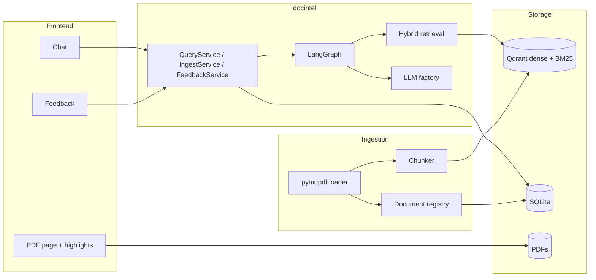
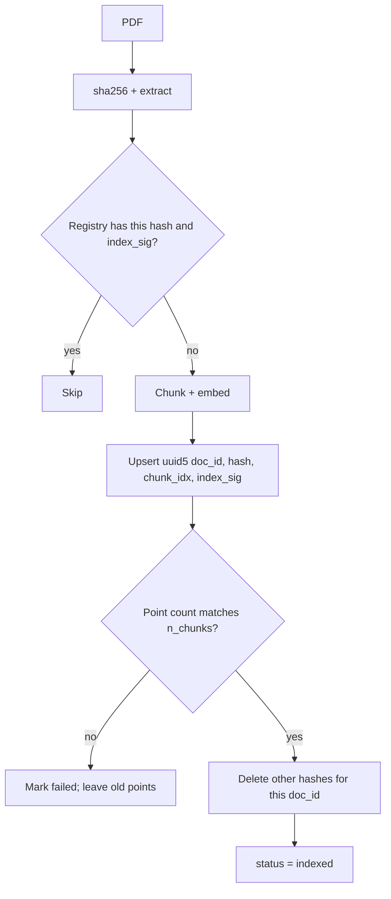
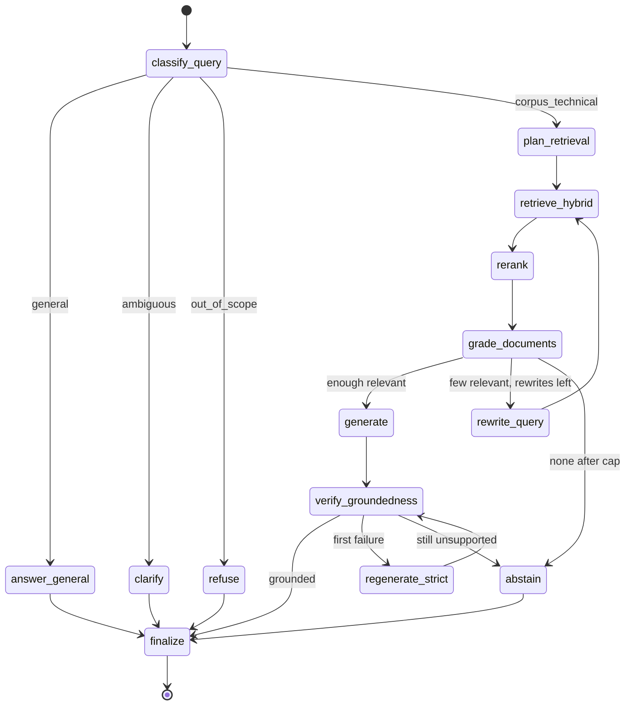

# System design: agentic hybrid RAG for commercial contracts

Document Intelligence answers questions over a corpus of SEC-filed commercial contracts (CUAD v1). It retrieves evidence from PDFs, cites page-level spans, abstains when the index does not support an answer, and answers ordinary world-knowledge questions from the language model with a disclaimer.

This document is the design reference. How to install and run the pipeline is in the [README](../README.md). Corpus join rules and CUAD quirks are in [DATA.md](DATA.md).

---

## Contents

1. [Goals and scope](#1-goals-and-scope)
2. [Data](#2-data)
3. [Architecture](#3-architecture)
4. [Ingestion and freshness](#4-ingestion-and-freshness)
5. [Retrieval](#5-retrieval)
6. [Agent graph](#6-agent-graph)
7. [Models and infrastructure](#7-models-and-infrastructure)
8. [Evaluation](#8-evaluation)
9. [Feedback](#9-feedback)
10. [Frontend](#10-frontend)
11. [Scaling](#11-scaling)
12. [Package layout](#12-package-layout)

---

## 1. Goals and scope

**In scope**

- Grounded Q&A over contracts with citations and PDF highlights.
- Hybrid retrieval (dense + sparse) with a measured comparison to dense-only.
- An agentic loop: route, retrieve, grade, rewrite, verify, abstain.
- Every stage selected by YAML profile so embedder, chunker, fusion, and LLM can change without code edits.
- Incremental ingest when a PDF is added or replaced.
- Local feedback capture and experiment tracking.

**Out of scope**

- Fine-tuning.
- OCR / layout models (CUAD PDFs have a text layer).
- Web search. General questions use parametric knowledge only.
- Auth, multi-tenancy, RBAC (described as a later deployment concern only).

---

## 2. Data

Indexed source is the PDF. TXT is a length oracle. Gold spans come from `master_clauses.csv`. Do not use `CUAD_v1.json` `answer_start`; those offsets are TXT-relative and do not line up with PDF text.

```text
data/CUAD_v1/
  full_contract_pdf/Part_{I,II,III}/<type>/*.{pdf,PDF}
  full_contract_txt/*.txt
  master_clauses.csv
```

Walk every file and test `suffix.lower()`. `rglob("*.pdf")` misses 311 uppercase `.PDF` names.

| Fact | Value |
|------|--------|
| PDFs on disk | 510 |
| Joinable to CSV + TXT | 506 (3 missing CSV, 1 byte-identical duplicate) |
| Indexed | 400, stratified over 25 agreement types, seed 42 |
| Also used for eval questions | 50 of those 400 (`index_and_eval`) |
| `qa_dev.json` | 40 items / 30 docs, document-disjoint from test |
| `qa_test.json` | 30 items / 20 docs |

Eval docs are the only member of their stem family so a question that names a contract has one valid `doc_id`. Clause cells in the CSV are Python list reprs; parse with `ast.literal_eval`.

A chunk is relevant in L1 only if it is from the gold `doc_id` and contains the gold span. The eval runner does not inject that `doc_id` as a filter; `FilterExtractor` has to find it from the question text. `--scoped` exists as a diagnostic.

Manifest: `data_manifest/corpus_manifest.json`. Rebuild: `scripts/select_corpus.py`, `scripts/build_eval_set.py`.

---

## 3. Architecture



Query path:

1. Classify the question (`corpus_technical`, `general`, `ambiguous`, `out_of_scope`).
2. For corpus questions: hybrid retrieve, optional rerank, grade chunks, rewrite if needed.
3. Generate a cited answer; verify claims against the cited chunks.
4. Abstain if nothing relevant remains, or if verification fails after one strict rewrite.
5. Log the query (route, chunk ids, latency, `config_hash`).

`config_hash` is sha256 of the resolved query-time config (no secrets). `index_sig` is sha256 of the ingestion subtree (loader, chunker, embedder, sparse encoder, `pipeline_version`). Collection name is `cuad_<index_sig[:12]>`. Two configs that differ in embedding-relevant fields never share a collection.

---

## 4. Ingestion and freshness

Prepare-then-swap. Embed first, upsert, count, then delete stale points. If embed fails, the previous version stays queryable.



- `--only-changed` (default) skips `indexed` rows with the same sha256 + `index_sig`. Pending, failed, or changed rows retry. `--full` re-embeds everything; point ids stay idempotent.
- `ensure_collection` refuses a dimension / distance mismatch.
- Embedded Qdrant is one process. Do not run a second ingest or eval against the same `.qdrant` while the UI holds it. Do not copy `.qdrant/` between machines; re-ingest.
- UI upload writes `data/uploads/<original-stem>__<uuid>.pdf`, checks `%PDF`, 25 MB, 300 pages, then calls the same incremental path. Uploads are fused into later searches so a type filter cannot hide `agreement_type=Unknown`.

---

## 5. Retrieval

| Mode | What runs |
|------|-----------|
| `dense` | Nomic (or profile embedder) ANN |
| `sparse` | fastembed BM25 |
| `hybrid` (default) | Both, fused with RRF (`k=60`). Client-side fusion is the default; Qdrant-native RRF/DBSF is available |

`k_candidates` is 20. Reranker default is `none`. Ablation profiles load `bge-reranker-base` or `bge-reranker-v2-m3`.

`FilterExtractor` reads the question, never the gold `doc_id`. A company token that matches exactly one catalog stem becomes a `doc_id` filter. A type phrase such as `maintenance agreement` becomes `agreement_type`. Search also always pulls indexed `/uploads/` documents and ORs `Unknown` into a type filter so a live upload stays visible.

---

## 6. Agent graph

Naive RAG always retrieves and always answers. This graph decides whether to retrieve, checks what it retrieved, retries the query, and abstains when the index does not support the claim. Patterns: Adaptive RAG (router), Corrective RAG (grader + rewrite), Self-RAG (groundedness).



| Node | Role | Notes |
|------|------|-------|
| `classify_query` | router | `general`, `corpus_technical`, `ambiguous`, `out_of_scope` |
| `retrieve_hybrid` | none | `RetrievalPipeline`; first-pass hits are kept across rewrites |
| `grade_documents` | grader | One batched structured call per rewrite |
| `rewrite_query` | router | Cap `max_rewrites` (2) |
| `generate` | generation | JSON `{answer, citations:[{chunk_id, quote}]}` |
| `verify_groundedness` | verifier | Claims vs cited chunks; quote must fuzzy-match the chunk |
| `abstain` | none | Explicit not-found; optional nearest passages |
| `answer_general` | generation | Disclaimer: not from the documents |

| Question | Route |
|----------|-------|
| Named contract / clause in the corpus | `corpus_technical` then cite or abstain |
| Definition or ordinary fact | `general` |
| Technical but which contract is unclear | `clarify` |
| Jailbreak or live unknowable fact | `out_of_scope` |

State stores ids, not chunk text. Text lives in a per-request `ChunkCache`. Each node appends timing to a JSONL trace under `traces/`. MLflow LangGraph autolog is optional.

Prompt injection: retrieved text is wrapped in `<evidence id=...>`. The citation validator rejects any `chunk_id` that was not retrieved.

---

## 7. Models and infrastructure

Device is `cuda` > `mps` > `cpu`. GPU wheels: `torch>=2.7` from the CUDA 12.8 index when on Windows. CPU smoke uses the `dev_cpu` profile (20 docs, `bge-small-en-v1.5`).

### Embeddings

| Model | Dim | Use |
|-------|-----|-----|
| `nomic-ai/nomic-embed-text-v1.5` | 768 | Default local (`gpu_default`). Task prefixes required |
| OpenAI `text-embedding-3-small` | 1536 | `openai_embed` profile; same `OPENAI_API_KEY` as chat |
| `BAAI/bge-small-en-v1.5` | 384 | `dev_cpu` |
| `BAAI/bge-m3` | 1024 | Optional ablation, not default |

Sparse default: fastembed BM25. Provider is never inferred from which API key exists.

### Chunking

Default `recursive`: 512 tokens, 64 overlap, separators `\n\n`, `\n`, `. `. Every chunk keeps `page_start` / `page_end` / `bboxes` by mapping char spans back to page blocks. `fixed_token` is the chunker ablation (`exp_chunk_fixed`). Overlap and a contextual type header limit boundary loss.

### Vector store

Qdrant: named dense + sparse vectors, payload indexes on `doc_id` and `agreement_type`, deterministic ids, embedded mode (`path=.qdrant`). Server mode is the scale-up path and uses the same client API. FAISS was rejected (no payload delete / freshness). Chroma was rejected (weak hybrid).

### LLMs

`init_chat_model("provider:model")`. Default provider: Anthropic.

| Role | Default |
|------|---------|
| router, grader, verifier | `anthropic:claude-haiku-4-5` |
| generation, judge | `anthropic:claude-sonnet-4-6` |

OpenAI and Gemini are the same factory plus the matching `.env` key. Missing key fails at startup with the variable name.

### Other

| Concern | Choice |
|---------|--------|
| Env | `uv`, Python 3.12, `uv.lock` |
| Config | pydantic-settings + YAML profiles |
| CLI | typer (`docintel`) |
| DB | SQLAlchemy 2 + SQLite; Postgres by URL |
| PDF | pymupdf |
| Tracking | MLflow `sqlite:///mlflow.db` |
| Traces | JSONL + optional MLflow autolog |

---

## 8. Evaluation

Two layers.

| Layer | Measures | Cost |
|-------|----------|------|
| L1 | P@k, R@k, hit@k, MRR, nDCG from gold spans | No LLM. Run on every retrieval ablation (`qa_dev`) |
| L2 | RAGAS faithfulness (headline), DeepEval as cross-check, custom route / abstain / citation / latency | Judge LLM. Reuse `generation_outputs.jsonl` across frameworks |

Span match: lowercase, collapse space, split gold on `<omitted>`, `partial_ratio >= 90`. Multi-span items report both any-span and all-spans.

`--split test` stays off until `evals/finalists.txt` lists the profile. A finished `--framework custom` checkpoint is left in place; later `ragas` / `all` reuse the generations.

Committed tables live under `results/`. `per_question.jsonl` and raw traces are gitignored.

---

## 9. Feedback

Same SQLite file as the document registry (`docintel.db`).

| Table | Role |
|-------|------|
| `documents` | ingest registry |
| `query_logs` | question, route, chunk ids, latency, `config_hash` |
| `feedback` | rating (`-1` or 1-5), tags, comment |

Analytics (`up` = rating >= 4, `down` = rating <= 2) by route, agreement type, and config hash: `scripts/analyze_feedback.py`.

---

## 10. Frontend

`uv run docintel serve --profile <name>` starts Streamlit in-process against the same `QueryService` as the CLI.

| Page | Behaviour |
|------|-----------|
| Ask the Corpus | Chat input, one status spinner for graph steps, citations, source PDF on the right, star rating |
| Documents | Manifest table + drag-and-drop ingest |
| Experiments | Committed `results/` comparison |
| Feedback | Rating aggregates |

`st.cache_resource(max_entries=1)` holds one client per process so two tabs cannot close a shared embedded Qdrant out from under each other. HTTP backend is reserved for a later FastAPI adapter.

---

## 11. Scaling

Phase 1 is a single process: Streamlit or CLI, embedded Qdrant, SQLite, local or API embedder.

Phase 2 keeps the graph, strategies, config schema, and eval harness. Adapters change: `vectorstore.mode: server`, `db_url` to Postgres, `frontend.backend: http`, embed/rerank behind TEI or similar, Redis for a semantic cache, a queue for ingest workers.

The expensive stage is LLM calls (about four on the happy path, more with rewrites). Mitigations already in the graph: skip retrieval on `general`, batch the grader, small model on router/grader/verifier. Concurrent capacity is `concurrency / p50_latency` times `llm_calls_per_query`, compared to provider RPM/TPM. Measured p50 on `qa_dev` is in `results/gpu_default_dev_cd2a4652f434_L2/`.

---

## 12. Package layout

```text
src/docintel/
  cli.py                 ingest, query, eval, serve, doctor
  config/                YAML merge, config_hash, index_sig
  data/                  CUAD walk, eval-set builders
  ingestion/             load, chunk, embed, Qdrant, registry
  retrieval/             hybrid, fusion, filters, rerank
  agent/                 LangGraph nodes and edges
  llm/                   factory + versioned prompts
  evaluation/            L1 metrics, RAGAS, DeepEval, MLflow
  feedback/              SQLAlchemy + analytics
  service/               composition root and facades
frontend/streamlit_app/
configs/base.yaml
configs/profiles/*.yaml
```

Every stage is an ABC registered by name. `service/container.py` is the only composition root. Nodes take dependencies in the constructor.

Config merge: `configs/base.yaml` + `configs/profiles/<name>.yaml` + `DOCINTEL__*` env overrides. Secrets stay in `.env`.
