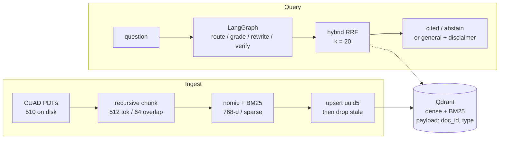
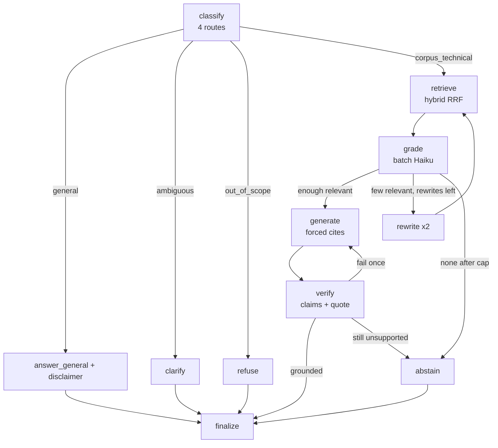

# Document Intelligence

**Grounded Q&A over commercial contracts**

**Track D** -- RAG / LLM Knowledge Systems
Abhik Debnath -- Scenario S2 -- CUAD v1

L1 numbers: `results/README.md`. L2 numbers: `results/gpu_default_dev_cd2a4652f434_L2/`.

---

## 1. Problem and domain

Legal and operations teams sit on hundreds of SEC-filed commercial contracts and need clause-level answers -- governing law, termination, exclusivity, fee waivers -- with a page cite. A fluent paragraph without evidence is a liability, not a feature. CUAD v1 (The Atticus Project, CC BY 4.0) is the right corpus: 510 contracts, 41 lawyer-labelled clause types, gold spans. I index 400 PDFs, stratified over 25 agreement types. The eval dataset is 40 items over 30 of those documents.

This is a retrieval problem, not a classification or fine-tune. The labels are extractive spans, not instruction pairs; a 7B LoRA (Track B) would memorize clause phrasing and still invent cites. A classical classifier (Track C) can tag "has a non-compete" but cannot quote the trigger. A three-agent CrewAI graph (Track A) adds messages without adding evidence. Track D is the fit: retrieve the span, generate only from it, abstain when it is missing.

**Figure 1.** Query and ingest share one Qdrant collection. The graph decides whether to retrieve.

---

## 2. Approach and algorithm decisions

Every default below beat a named alternative on this corpus or was rejected for a documented reason. Stages are YAML strategies; swapping embedder or fusion does not touch graph code.

| Choice | Default | Rejected, and why |
|---|---|---|
| Chunking | Recursive 512 / 64. Page + bboxes on every chunk. | **Page-as-chunk** mixes recitals with the operative clause. **Fixed 512** splits mid-sentence. **Late chunking** needs a long-context embedder we do not serve. A 600-token indemnity straddles two chunks; 64-token overlap plus a type header recovers it. Gold is PDF text, never CUAD `answer_start`. |
| Embedder | nomic-embed-text-v1.5, 768-d, local, task prefixes. | **OpenAI 3-small**: clause text leaves the machine. **bge-small**: 384-d under-resolves long legal sentences (CPU smoke only). **bge-m3**: multilingual capacity we do not need. Nomic prefixes match how the questions are phrased. |
| Store | Embedded Qdrant, dense + sparse, payload on `doc_id` / type. | **FAISS**: no payload delete, so freshness is a full rebuild. **Chroma**: weak hybrid. Server mode is the same client. |
| Fusion | Client RRF, k=60. Reranker off on the demo path. | Hybrid lifts dense-only hit@5 by +0.20 (table below). Sparse-only wins this extractive L1 set; hybrid stays default for paraphrase ("what if NII goes negative"). **bge-reranker-v2-m3**: +0.03 hit@5, not worth a cross-encoder inside a 90 s graph. Client RRF is unit-testable without a live store. |
| Control | One LangGraph: Adaptive + Corrective (cap 2) + Self-RAG. | **Naive RAG** cannot abstain. **Multi-agent chat** re-encodes the same four LLM calls. Router / grader / verifier: Haiku. Generation: Sonnet. |

**Figure 2.** Agent graph. First-pass hits are kept across rewrites. Unsupported claims get one strict regenerate, then abstain.

Jailbreak / live unknown routes to refuse. "Capital of France" routes to general plus a disclaimer.

**Hallucination.** Retrieved text is wrapped in `<evidence id=...>`. Generation emits `{answer, citations:[{chunk_id, quote}]}`. The verifier checks claims against cited chunks, fuzzy-matches the quote (threshold 90), and rejects any `chunk_id` that was not retrieved. Failure: one strict regenerate, then abstain.

**Query analysis.** Stamps.com governing law -> *corpus_technical*, cite. "What is an indemnity clause?" -> *general*, disclaimer. Two Maintenance docs in play -> *clarify*. Jailbreak / live unknowable fact -> *refuse*.

**Freshness.** Registry key is sha256 + `index_sig`. `--only-changed` embeds new bytes, upserts deterministic ids, counts, then deletes other hashes for that `doc_id`. A failed embed leaves the previous version queryable. UI uploads are `Unknown`; search ORs that into any type filter so a new PDF is visible without re-embedding the 400-doc index.

---

## 3. Results and error analysis

L1 is deterministic span match on the eval dataset (n=30). The eval runner never injects the gold `doc_id`; `FilterExtractor` has to find it from the question. L2 is the same questions plus the remaining route / abstain items (n=40). RAGAS faithfulness is the declared headline. DeepEval is the cross-check -- it saturates (0.966) and disagrees with RAGAS (Spearman 0.01 on n=19 overlap), so I do not swap the headline after seeing it.

**L1 retrieval, eval dataset**

| Method | hit@5 | R@10 | nDCG@10 | MRR |
|---|---:|---:|---:|---:|
| dense-only | 0.533 | 0.692 | 0.444 | 0.351 |
| hybrid RRF (default fusion) | 0.733 | 0.758 | 0.502 | 0.390 |
| hybrid + bge-reranker-v2-m3 | 0.767 | 0.795 | 0.551 | 0.443 |
| sparse-only (L1 winner, not default) | 0.800 | 0.770 | 0.606 | 0.544 |

**L2 generation, gpu_default / eval dataset / cd2a4652f434**

| Metric | Value |
|---|---:|
| RAGAS faithfulness (headline) | 0.636 |
| RAGAS context precision / recall | 0.690 / 0.700 |
| Custom groundedness / route accuracy / citation validity | 0.605 / 1.00 / 1.00 |
| Abstention precision / recall | 0.40 / 0.75 |
| Latency p50 / p95 / LLM calls per query | 48 s / 67 s / 6.5 |
| DeepEval faithfulness (cross-check, saturates) | 0.966 |

**Where it fails.** Faithfulness 0.636 means about one third of generated claims are not fully supported by the retrieved chunk -- usually a hedge the verifier lets through ("the agreement appears to..."). Abstention precision 0.40: we refuse questions the gold can answer, typically when the grader wants two relevant chunks and the first pass finds one (governing-law items burn two rewrites and ~75 s). Parties gold is many two-letter fragments; span-match recall is optimistic and I report it separately. Sparse-only beating hybrid on L1 is real: this eval set is extractive. I am not hiding that. Hybrid is the production default for the paraphrase case the span metric under-counts.

---

## 4. Production and limitations

**Production and the limit I would fix first.** The 400-doc index is ~11k chunks; adding one contract must not re-embed the rest (content-addressed points, prepare-then-swap). At 1,000 concurrent queries the bottleneck is 6.5 LLM calls x 48 s p50 against provider RPM, not Qdrant. The graph already skips retrieval on *general*, batches the grader, and puts Haiku on the cheap roles. Scale-out is server-mode Qdrant, embed behind TEI, and a cache on `(config_hash, question)`. The 48 s p50 is a review tool, not a desk product: close it with a score-threshold first grade and a tighter rewrite cap. No OCR.
